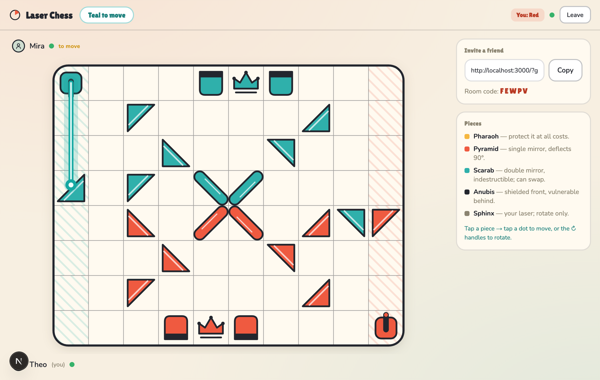
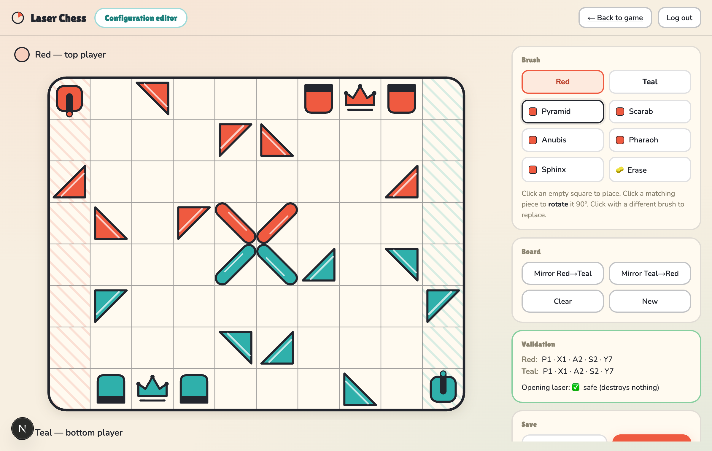

# ⚡ Laser Chess

**Real-time, online-multiplayer Laser Chess:** a Khet-style strategy game where you
rotate mirrors to bend a laser across the board and burn your opponent's Pharaoh.
Share a link and play a friend in the browser: no install, no account.

[**▶ Live demo**](https://laser-chess-n6nu.onrender.com) &nbsp;·&nbsp;




## Features

- **Online multiplayer** over WebSockets — create a game, share the link, and an opponent
  joins straight from the URL. Includes spectators, live presence, and reconnect-on-refresh.
- **Authoritative server** — every move and the full laser trace is resolved server-side,
  so game state can't be tampered with from the client.
- **One shared game engine** — the rules (movement, mirror reflection, win detection) live
  in a single isomorphic TypeScript module used by *both* the server and the browser, so
  they can never drift out of sync.
- **Smooth 60 fps canvas rendering** — layered canvases and a hand-tuned animation loop
  keep the travelling laser beam and explosions fluid. No game or graphics libraries.
- **Hand-drawn, responsive UI** — a warm line-art theme that adapts to desktop and mobile.
- **Built-in board editor** — a small admin tool to visually design and validate custom
  starting positions, with a live "is the opening safe?" check.
- **Durable persistence (optional Postgres)** — custom setups, the admin secret, and
  *in-progress games* are written through to a database, so configurations and live matches
  survive a redeploy/restart. Falls back to local files with zero setup in development.

## Tech stack

`Next.js (App Router)` · `React 19` · `TypeScript` · custom `Node` server · `ws` (WebSockets) · HTML5 `Canvas`

The rules engine, the renderer, and the networking are all written from scratch — no chess/game
engine and no realtime SaaS.

## How it works

The interesting engineering lives in three places:

- **Custom server + WebSockets.** Next.js is wrapped by a custom Node server
  ([`server.mts`](server.mts)) so it can hold long-lived WebSocket connections for real-time
  play — something serverless functions can't do. `/ws` upgrades route to the game server;
  everything else is handled by Next.
- **Isomorphic, authoritative rules.** [`src/game/`](src/game) is pure and dependency-free.
  The server uses it to validate moves and trace the laser; the browser imports the *same*
  code to show legal moves and drive animations. The server stays the source of truth.
- **Imperative rendering, outside React.** The canvas renderer
  ([`src/lib/render.ts`](src/lib/render.ts)) owns three stacked layers (board / pieces /
  effects) and runs its own `requestAnimationFrame` loop, so 60 fps laser animations never
  fight React's render cycle. React just subscribes to a small immutable view snapshot.

```
src/
  game/        shared, pure rules — engine, starting positions, types, wire protocol
  server/      authoritative WebSocket game server, rooms, admin auth, storage (file/Postgres)
  lib/         canvas renderer + network client
  client/      framework-agnostic game controller (+ a React hook over it)
  components/   React UI
  app/         Next.js App Router — pages and API routes
server.mts     custom server: Next request handler + WebSocket upgrade routing
```

## Run locally

```bash
npm install
npm run dev        # http://localhost:3000
```

Open the link in two browser tabs to play both sides.

## How to play

Each turn, **move** a piece one square (any direction) **or rotate** it 90°; then your laser
fires automatically from your Sphinx. A piece struck on a non-mirror face is destroyed —
hit the enemy Pharaoh to win.

| Piece | Behaviour |
|---|---|
| **Pharaoh** | Your king — if any laser hits it, you lose. |
| **Pyramid** | One mirror; deflects the beam 90°. |
| **Scarab** | Double mirror; always deflects, never destroyed. |
| **Anubis** | Shielded in front; vulnerable from the side or back. |
| **Sphinx** | Your laser cannon in the corner (rotate only). |

Four built-in starting positions ship with the game, and you can design your own in the editor:


